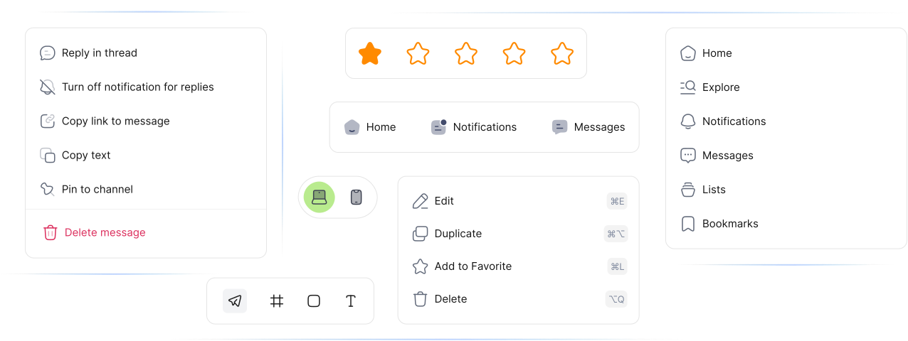

# Houston Pro - React Icons

Welcome to the professional edition of Houston for React — an extensive library of meticulously crafted icons designed to elevate the visual appeal of your web and mobile applications. With Houston React Pro , you gain access to a vast selection of icons tailored to suit every need, allowing for highly customizable and dynamic user interfaces.

Thousands of designers, developers, and content creators use Houston Pro for unlimited personal and commercial projects, making it one of the most versatile and user-friendly icon libraries available.

Discover more at our website: [houston.com](https://houston-icons.vercel.app/)




## Table of Contents
- [Features](#features)
- [Installation](#installation)
- [Usage Examples](#usage-examples)
- [Live Example](#live-example)
- [Contributing](#contributing)
- [FAQ](#faq)
- [License](#license)

## General Usage

Icons can be downloaded from the [Houston website](https://houston-icons.vercel.app) and used in your projects. The icons are available in SVG format and can be easily integrated into your applications.

## Features

### Autocomplete for Efficiency
Swiftly find the icon you need with our intuitive autocomplete feature, streamlining your design process.

### Customizable Size
Freedom to scale: adjust icon sizes effortlessly to match your design requirements.

### Multiple Variants
Seven distinct variants ensure that you can select the perfect style to match your project's aesthetics.

### Unlimited Colors
Customize icon colors with ease, giving you the ability to maintain consistency with your brand's color palette.

### Expansive Library
Access over 27,000 icons within the library, ensuring you'll find the exact icon for every context.

## Installation

To start using HoustonIcons-React in your project, install the package via npm:

```bash
npm install houstonicons-react
```

Or via yarn:

```bash
yarn add houstonicons-react
```

## Usage Examples

Import the icons you need from the library and integrate them into your React components. Here's how you can customize the icons to fit your needs:

### Control Icon Size
Adjust the size of your icons by passing a `size` prop:

```jsx
import { Home01Icon } from "houstonicons-react";

<Home01Icon size={32} /> // Custom size
```

### Customize Icon Color
Change the color of your icons by passing a `color` prop:

```jsx
import { MarketingIcon } from "houstonicons-react";

<MarketingIcon color="#00FF00" /> // Green color
```

### Adjust Icon Corners
Easily modify the corner style of your icons by using the cornerStyle prop:

```jsx
import { ListSettingIcon } from "houstonicons-react";

<ListSettingIcon cornerStyle="rounded" /> // Rounded corners
```

### Control Icon Fill Type
Set the fill style of your icons using the fillType prop:

```jsx
import { AddSquareIcons } from "houstonicons-react";

<AddSquareIcons fillType="solid" /> // Solid fill
```

## Live Example

Explore a live demonstration of HugeIcons React in action at [Houston Pro Example](https://houston-icons.vercek.app/docs). This example showcases the versatility and ease of customizing our icons to fit your design needs, providing a hands-on experience with the icon collection.

## Example

Check out our example project to see HoustonIcons-Pro in action and explore more customization options.

## FAQ

**Q: How can I download and use free React icons from Houston React Icons?**
A: You can install the package via npm or yarn and then import the react icons into your react components. Detailed package installation instructions are provided in the [Installation](#installation) section.

**Q: Are these React icons customizable in terms of size and color?**
A: Yes, all react icons are fully customizable. You can adjust their size, color, and other properties easily within your React application. See [Usage Examples](#usage-examples) for more information.

**Q: Can I contribute my own designs to the Houston React collection?**
A: Absolutely! We welcome contributions. Please refer to our [Contributing](#contributing) section for guidelines on how to submit your icons.

**Q: Is there a live demo where I can see these React icons in action?**
A: Yes, we have a live example available at [Houston React Example](#live-example). It showcases the usage import various react icons and their customization options.

**Q: Are the react icons from Houston React Icons free for commercial use?**
A: Houston React Pro is licensed for commercial use, adhering to the [CC0-1.0](#license). Please review the license details for more information.

---

Enjoy the seamless integration of premium icons with Houston React Pro and take your application to the next level!

---


## License

Houston React is licensed under the CC0 1.0 Universal (CC0 1.0) Public Domain Dedication. This means you can use, modify, distribute, and even use the icons for private or commercial purposes, without any restrictions. No attribution is required, but it's appreciated.

For more details, see the [LICENSE.md](./LICENSE.md) file in the repository.
